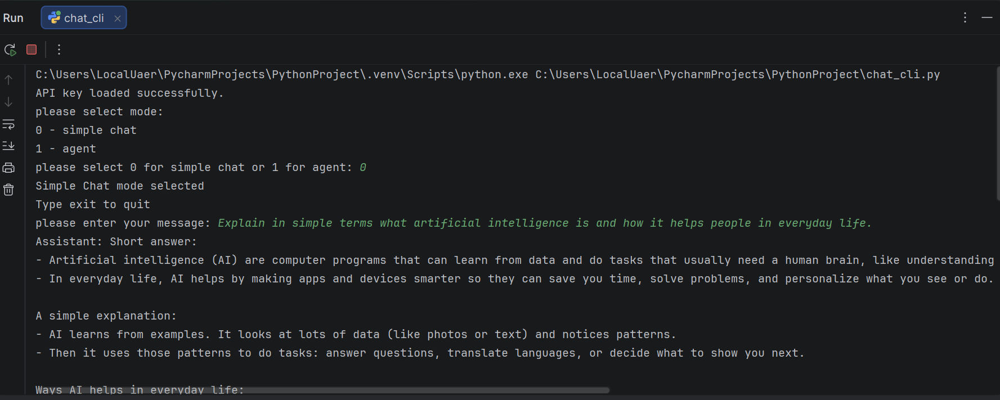
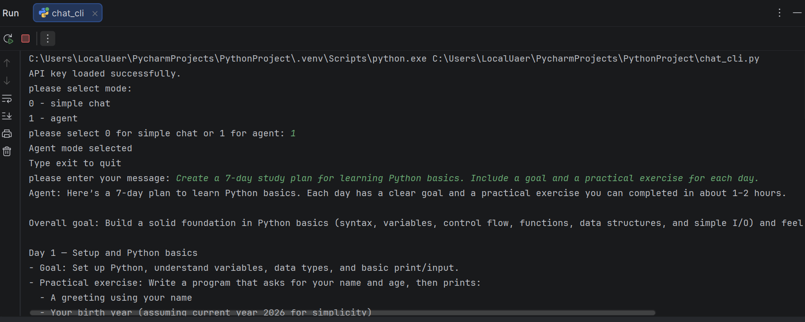
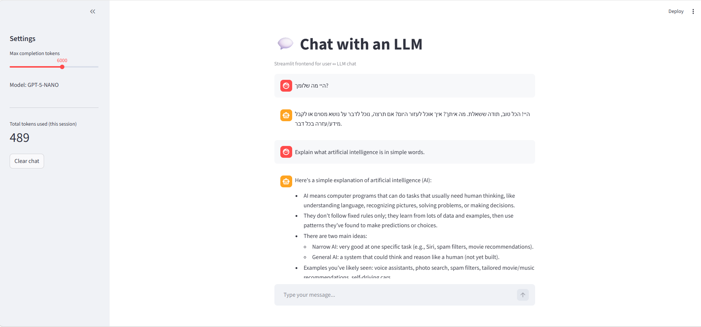

<div dir="rtl">

# אפליקציית צ'אט עם מודל שפה

## תיאור הפרויקט

בפרויקט זה פותחה אפליקציית צ'אט המתקשרת עם מודל השפה GPT-5-NANO באמצעות ה־API של המכללה. האפליקציה מאפשרת למשתמש לכתוב הודעות, לשלוח אותן למודל, לקבל תשובה ולהציג את היסטוריית השיחה, תוך מעקב אחר צריכת הטוקנים.

## רכיבי הפרויקט

הפרויקט כולל:

- צ'אט בסיסי דרך שורת הפקודה (CLI) באמצעות הקובץ `chat_cli.py`.
- אפשרות בחירה בין מצב צ'אט רגיל (Chat Completions) לבין מצב Agent (Responses API).
- ממשק משתמש ויזואלי באמצעות Streamlit בקובץ `app.py`.
- שמירת היסטוריית שיחה במהלך השימוש.
- תמיכה בעברית ובאנגלית (לפי שפת המשתמש).
- ניהול מפתח API באמצעות קובץ `.env` ובאמצעות הספרייה `python-dotenv`.
- מעקב חי אחר צריכת טוקנים בכל סבב שיחה.
- הפרדה ברורה בין קבצים רגישים לבין קבצים המועלים ל־GitHub באמצעות `.gitignore`.

## דרישות מערכת

כדי להריץ את הפרויקט נדרש:

- Python גרסה 3.10 ומעלה.
- התקנת הספריות המופיעות בקובץ `requirements.txt`.

הספריות המרכזיות בפרויקט:

- `requests` – שליחת בקשות HTTP ל־API.
- `streamlit` – בניית הממשק הוויזואלי.
- `python-dotenv` – טעינת משתני סביבה מקובץ `.env`.

## הוראות התקנה

### שלב 1 – שכפול המאגר

```bash
git clone https://github.com/Linoy699/ai-chat-assignment.git
cd ai-chat-assignment
```

### שלב 2 – יצירת סביבה וירטואלית

מומלץ לעבוד בסביבה וירטואלית כדי לבודד את התלויות:

```bash
python -m venv .venv
```

הפעלת הסביבה הווירטואלית:

- ב־Windows:

  ```bash
  .venv\Scripts\activate
  ```

- ב־macOS / Linux:

  ```bash
  source .venv/bin/activate
  ```

### שלב 3 – התקנת התלויות

```bash
pip install -r requirements.txt
```

## הגדרת מפתח API

יש ליצור קובץ בשם `.env` בתיקיית הפרויקט. בתוך הקובץ יש להכניס את מפתח ה־API בצורה הבאה:

```
IAC_API_KEY=your_api_key_here
```

הערה חשובה: אין להעלות את קובץ `.env` ל־GitHub, מכיוון שהוא מכיל מפתח אישי וסודי. הקובץ `.gitignore` שבמאגר מונע זאת באופן אוטומטי.

## בדיקה ראשונית של החיבור ל־API

לפני הרצת הצ'אט עצמו ניתן לוודא שהמפתח תקין ושיש חיבור לשרת המכללה באמצעות:

```bash
python get_api_key.py
```

הסקריפט שולח בקשה מינימלית ל־API ומדפיס את תשובת המודל ואת צריכת הטוקנים בבדיקה.

## הרצת הצ'אט בשורת הפקודה

```bash
python chat_cli.py
```

לאחר ההרצה ניתן לבחור מצב עבודה:

- `0` – צ'אט רגיל באמצעות Chat Completions.
- `1` – מצב Agent באמצעות Responses API.

כדי לצאת מהצ'אט יש לכתוב `exit`.






## הרצת אפליקציית Streamlit

```bash
streamlit run app.py
```

לאחר ההרצה תיפתח האפליקציה בדפדפן בכתובת המקומית, בדרך כלל `http://localhost:8501`. בממשק ניתן לראות את היסטוריית השיחה, סרגל צד עם כפתור איפוס שיחה ומחוון `Max completion tokens`, וכן הצגה של צריכת הטוקנים בכל סבב ובמצטבר.


## מבנה הפרויקט

```
.
├── app.py              – ממשק Streamlit
├── chat_cli.py         – צ'אט בשורת הפקודה (chat + agent)
├── get_api_key.py      – סקריפט לבדיקת תקשורת ל־API
├── requirements.txt    – רשימת התלויות
├── .gitignore          – קבצים שאינם מועלים ל־Git
├── README.md           – קובץ זה
└── .env                – מפתח API (אינו מועלה ל־Git)
```

## הסבר על הקבצים

- `chat_cli.py` – הצ'אט הבסיסי הפועל בשורת הפקודה, בשני מצבים: Chat Completions ו־Responses API.
- `app.py` – הממשק הגרפי המבוסס על Streamlit, אשר עוטף את ה־Chat Completions, שומר היסטוריית שיחה ב־`st.session_state` ומציג את צריכת הטוקנים.
- `get_api_key.py` – סקריפט בדיקה קצר שמוודא שהמפתח שב־`.env` תקין ושה־API נגיש. אינו יוצר מפתח חדש – יצירת המפתח מתבצעת מול המכללה.
- `requirements.txt` – רשימת הספריות הדרושות להרצה.
- `.gitignore` – מונע העלאה של קבצים רגישים (`.env`) ושל קבצי סביבה (`.venv`, `__pycache__`).
- `.env` – קובץ סודי שבו נשמר מפתח ה־API. אינו מועלה ל־Git.

## אופן העבודה הכללי של המערכת

המשתמש כותב הודעה בממשק (CLI או Streamlit). ההודעה נשלחת באמצעות בקשת HTTP אל שרת ה־API של המכללה. המודל GPT-5-NANO מעבד את הקלט בהתבסס על היסטוריית השיחה הקיימת, ומחזיר תשובה. התשובה מוצגת למשתמש, נשמרת בהיסטוריה, ומידע על צריכת הטוקנים מוצג בכל סבב כדי לאפשר מעקב אחר המכסה.

## טיפול בשגיאות

הפרויקט כולל טיפול בשגיאות בסיסיות:

- בדיקה שהמפתח נטען וכי הפורמט שלו תקין.
- טיפול בשגיאות רשת באמצעות `try/except` סביב קריאות ה־HTTP.
- בדיקת קוד תגובה (`status_code`) והצגה ברורה של תקלות מצד השרת.
- ולידציה של קלט המשתמש (קלט ריק, בחירת מצב לא חוקית).
- מניעת חשיפת מפתח API באמצעות `.gitignore` והפרדה לקובץ `.env`.

## מאגר ה־Git

קישור למאגר: [https://github.com/Linoy699/ai-chat-assignment](https://github.com/Linoy699/ai-chat-assignment)

## חברי צוות

- לינוי בניטה ויצמן - ת"ז 207198805
- מלי בן דויל - ת"ז 200285583
- דניאל ששון- ת"ז 205987712

</div>
